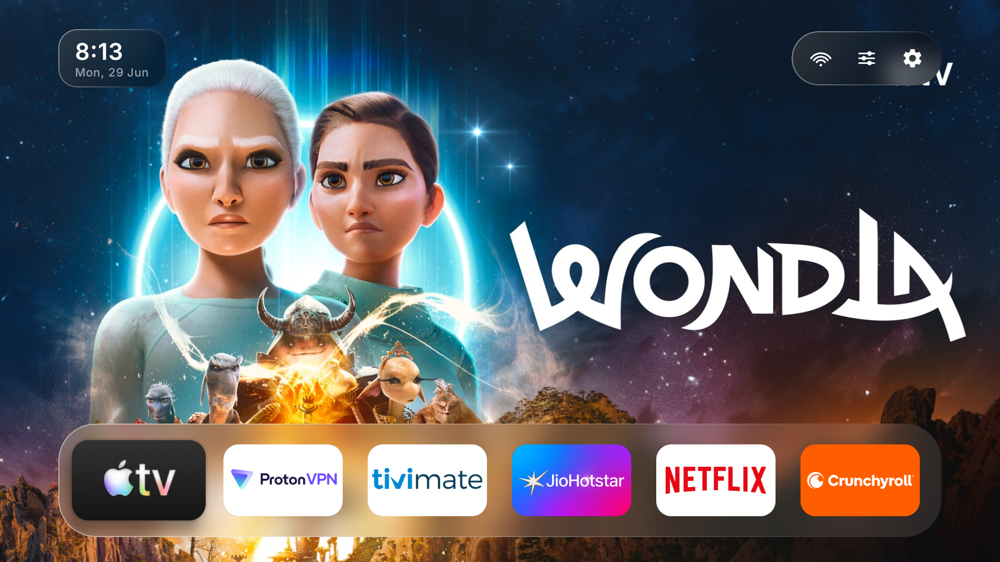

<div align="center">

# 🌊 Tarang

### A minimal, tvOS‑inspired launcher for Android TV & Google TV.

Full‑bleed artwork, liquid‑glass chrome, and a dock that gets out of your way — built D‑pad‑first for the living room.




</div>

---

## ✨ Highlights

- **A home that disappears.** At rest you see only the wallpaper and a frosted dock pinned to the bottom. Press **down** and your full app grid slides up — Apple‑TV style.
- **Living wallpapers.** Hover a favorite and its show/movie poster plays full‑screen as the background, with a soft ambient glow tuned to whatever you're pointing at.
- **Real Liquid Glass.** The clock, status pills, and dock refract the wallpaper through their edges via an AGSL shader (Android 13+), over a true frosted blur.
- **Made for the remote.** Every interaction is D‑pad‑first — snappy focus, long‑press menus, no touch required.
- **Actually replaceable.** A guided **Home setup** flow gets Tarang running as your TV's home screen, even on Google TV where the system blocks setting a third‑party launcher.

---

## 📸 A look around

<table>
  <tr>
    <td width="50%"><br/><sub><b>Home</b> — frosted dock, full‑bleed wallpaper, nothing else in the way.</sub></td>
    <td width="50%"><br/><sub><b>App artwork</b> — the focused favorite's poster becomes the wallpaper.</sub></td>
  </tr>
  <tr>
    <td width="50%"><br/><sub><b>App grid</b> — press down to reveal every installed app.</sub></td>
    <td width="50%"><br/><sub><b>Long‑press menu</b> — favorite, hide, app info, uninstall.</sub></td>
  </tr>
  <tr>
    <td width="50%"><br/><sub><b>Settings</b> — theme, wallpapers, grid density, app artwork.</sub></td>
    <td width="50%"><br/><sub><b>Home setup</b> — live checks + deep‑links to become the default Home.</sub></td>
  </tr>
</table>

---

## 🎛 Features

**Home & navigation**
- Frosted **dock** of favorites — pin, reorder (move mode), and remove your most‑used apps.
- **App grid** of every launchable app (TV apps *and* sideloaded phone apps), sorted alphabetically and refreshed live as you install/uninstall.
- Dock anchored to the bottom with the grid tucked below the fold, so the home screen stays calm.

**Look & feel**
- **App‑artwork wallpaper** — plays a favorite's TV poster art while it's focused (reads the system TV artwork).
- **Wallpapers** — gradient presets, your own photo, or app artwork; animated drift, an ambient glow that picks up the focused app's color, and an optional blur.
- **Liquid Glass** — AGSL refraction + frosted blur on the chrome (Android 13+), with a plain‑blur fallback on older devices.
- **Theme** — Light, Dark, or Automatic (follows time of day).
- **Adjustable density** — 3 to 7 columns.

**Daily driver**
- **App management** from a long‑press: add/remove favorite, **Hide app**, **App info**, **Uninstall**.
- **Hidden apps** — tuck apps out of the grid and bring them back from Settings.
- **Idle screensaver** — a Ken‑Burns slideshow of your apps' artwork (or a clock) after a configurable timeout.
- **Reduce motion** — calms wallpaper drift, the slideshow, and tile‑focus springs.
- **Home setup** — detects whether Tarang is your default Home and whether the redirect service is on, and deep‑links you to fix each. On Google TV (which won't let an app set itself as Home) an accessibility service quietly returns you to Tarang whenever the stock launcher surfaces.
- **Status bar** — clock & date, Wi‑Fi indicator, and quick shortcuts into Wi‑Fi / Android settings.

---

## 🛠 Built with

- **Kotlin** + **Jetpack Compose for TV** (`androidx.tv:tv-material3`)
- **MVVM** with `StateFlow` and manual DI
- **DataStore (Preferences)** for settings
- **AGSL `RuntimeShader`** for the glass refraction
- Min SDK **28** (Android 9) · Target/Compile SDK **35** · built from the **Gradle CLI** (no Android Studio required)

---

## 🚀 Build & install

```bash
# Build a release APK
./gradlew :app:assembleRelease

# Install to a connected device (or wireless ADB target)
adb install -r app/build/outputs/apk/release/app-release.apk
```

> **Tip:** debug builds run fine on an emulator but are noticeably slow on real TV hardware — use the **release** build on a device.

Then, on the device, open **Settings → Home setup** and follow the steps to make Tarang your home screen.

---

<div align="center">
<sub><i>Tarang</i> (तरंग) — "wave." Built for the couch. 🛋️</sub>
</div>
